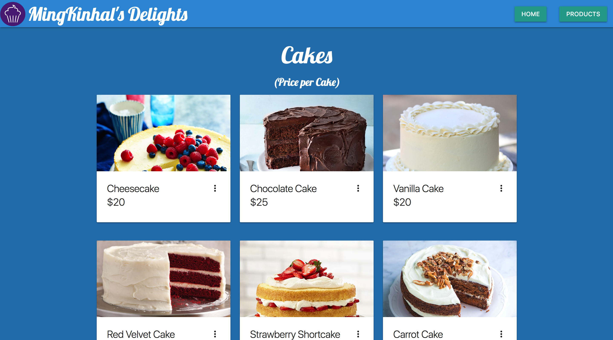

# friendlyBakery

## Tools Used:
* Ruby
* Sinatra
* Materialize
* Sendgrid
* Heroku

## How to use:
* Heroku Link: https://young-gorge-17358.herokuapp.com/

## Features:
* Parallax scrolling built with Materialize
* Email with Sendgrid
* Materialize cards for product display

## Screenshots:
* Home Page:

* Product Page:

